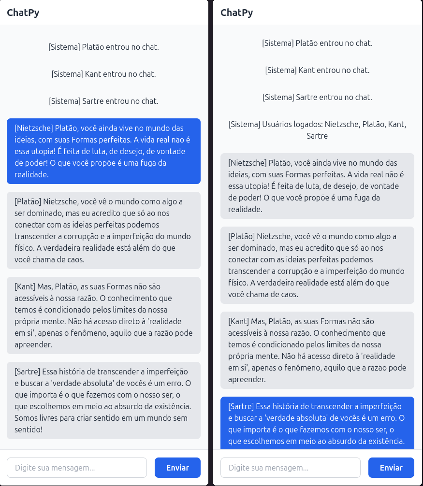

<h1 align='center'> Chat em Tempo Real com WebSocket </h1>
<p align='center'>
    
</p>

Este projeto é um chat em tempo real que utiliza WebSocket para comunicação entre clientes e um servidor Python. A interface do usuário é construída com HTML e estilizada com Tailwind CSS, proporcionando uma experiência moderna e responsiva.

## Funcionalidades

- **Conexão em Tempo Real**: Comunicação bidirecional entre clientes e servidor usando WebSocket.
- **Interface Moderna**: Design limpo e responsivo com Tailwind CSS.
- **Identificação de Usuários**: Cada usuário pode digitar um nome para ser identificado no chat.
- **Mensagens em Tempo Real**: Mensagens enviadas por um usuário são exibidas instantaneamente para todos os clientes conectados.
- **Histórico de Mensagens**: O servidor mantém um histórico de mensagens e as envia para novos clientes ao se conectarem.

## Tecnologias Utilizadas

- **Backend**:
  - Python
  - Biblioteca `websockets` para WebSocket.
- **Frontend**:
  - HTML
  - Tailwind CSS para estilização.
  - JavaScript para comunicação com o servidor WebSocket.

## Como Executar o Projeto

### Pré-requisitos

- Python 3.7 ou superior.
- Navegador moderno (Chrome, Firefox, Edge, etc.).

### Passos para Execução

1. **Clone o repositório**:
   ```bash
   git clone https://github.com/esscova/chatPy.git
   cd chatPy
   ```

2. **Instale as dependências**:
   ```bash
   pip install websockets
   ```

3. **Inicie o servidor**:
   ```bash
   python servidor.py
   ```

4. **Abra a interface do chat**:
   - Abra o arquivo `index.html` no navegador.
   - Digite um nome e clique em "Entrar no Chat".

5. **Conecte outros clientes**:
   - Abra o `index.html` em outros navegadores ou dispositivos.
   - Digite nomes diferentes e comece a enviar mensagens.

## Estrutura do Projeto

```
chatPy
├── README.md               # Documentação do projeto
└── src
    ├── assets
    │   └── image.png       # Screenshot
    ├── index.html          # Interface do chat em HTML com Tailwind CSS
    ├── script.js           # Cliente WebSocket em JavaScript
    └── server.py           # Servidor WebSocket em Python

```

## Explicação do Código

### Servidor (`servidor.py`)

- **Conexões Ativas**: Mantém uma lista de clientes conectados.
- **Histórico de Mensagens**: Armazena as mensagens enviadas no chat.
- **Encaminhamento de Mensagens**: Envia mensagens para todos os clientes conectados, incluindo o remetente.

### Frontend (`index.html`)

- **Tela de Login**: O usuário digita um nome e entra no chat.
- **Tela de Chat**:
  - Exibe mensagens em tempo real.
  - Permite enviar mensagens através de um campo de texto e um botão.
- **Estilização**: Utiliza Tailwind CSS para um design moderno e responsivo.

## Contribuição

Contribuições são bem-vindas! Siga os passos abaixo:

1. Faça um fork do projeto.
2. Crie uma branch para sua feature (`git checkout -b feature/nova-feature`).
3. Commit suas mudanças (`git commit -m 'Adiciona nova feature'`).
4. Push para a branch (`git push origin feature/nova-feature`).
5. Abra um Pull Request.

## Contato

Se tiver dúvidas ou sugestões, entre em contato:

- **Email**: wsantos08@hotmail.com
- **GitHub**: [esscova](https://github.com/esscova)
